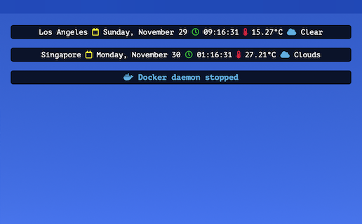

# MiniBar



## Installation

Place the widget into the Übersicht widget directory.

Copy config.template.json as config.json and place your OpenWeatherMap API key.

## Options

```js
const options = {
  top: "20px",
  left: "420px",
  width: "600px",

  // Refer to https://en.wikipedia.org/wiki/List_of_tz_database_time_zones
  timezone: "US/Pacific",

  city: "Los Angeles",
};
```
